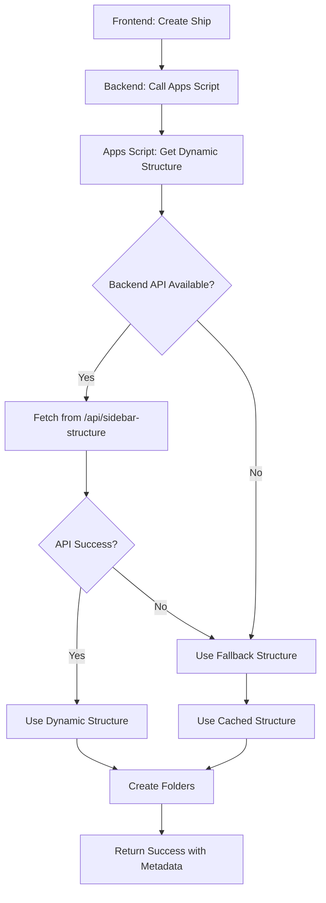

# Dynamic Sidebar Structure Integration

## 🎯 **TÍNH NĂNG MỚI**

### **Automatic Homepage Sidebar Synchronization**
- 🔄 Apps Script tự động lấy folder structure từ Homepage Sidebar khi tạo ship
- 📱 Real-time synchronization với frontend structure
- 🛡️ Fallback mechanism khi không thể connect backend
- 📊 Chi tiết logging và metadata tracking

---

## ✅ **ĐÃ HOÀN THÀNH**

### 1. **Backend API Endpoint**
- ✅ Thêm `/api/sidebar-structure` endpoint
- ✅ Trả về current sidebar structure từ backend
- ✅ Include metadata (version, categories count, etc.)

### 2. **Enhanced Google Apps Script**
- ✅ Function `getDynamicFolderStructure()` để call backend API
- ✅ Function `getFallbackFolderStructure()` cho fallback
- ✅ Cập nhật `handleCreateCompleteShipStructure()` với dynamic logic
- ✅ Enhanced logging và error handling

### 3. **Backend Integration**
- ✅ Gửi `backend_api_url` parameter khi call Apps Script
- ✅ Support cho cả static và dynamic folder structure creation

---

## 📝 **HƯỚNG DẪN CẬP NHẬT**

### Bước 1: Cập nhật Google Apps Script
1. Mở [Google Apps Script](https://script.google.com/)
2. Thay thế toàn bộ code bằng nội dung từ `/app/DYNAMIC_GOOGLE_APPS_SCRIPT.js`
3. Deploy lại script

### Bước 2: Test Dynamic Structure
1. Tạo ship mới từ frontend
2. Kiểm tra backend logs để xem API calls
3. Verify folder structure trên Google Drive

---

## 🔧 **CÁCH HOẠT ĐỘNG**

### Workflow khi tạo Ship Folder:



### 1. **Dynamic Structure Fetch**
```javascript
// Apps Script calls backend API
GET https://shipment-ai-1.preview.emergentagent.com/api/sidebar-structure

// Response:
{
  "success": true,
  "structure": {
    "Document Portfolio": ["Certificates", "Inspection Records", ...],
    "Crew Records": ["Crew List", "Crew Certificates", ...],
    ...
  },
  "metadata": {
    "structure_version": "v3.3",
    "total_categories": 6,
    "total_subcategories": 21,
    "source": "homepage_sidebar_current"
  }
}
```

### 2. **Fallback Mechanism**
- API không available → Dùng cached structure
- API error → Dùng fallback structure  
- Invalid response → Dùng default structure
- Luôn log reason cho debugging

### 3. **Enhanced Logging**
```javascript
Logger.log("📡 Fetching dynamic folder structure from: " + apiUrl);
Logger.log("✅ Successfully fetched dynamic folder structure");
Logger.log("📊 Structure version: " + result.metadata.structure_version);
Logger.log("📊 Categories: " + result.metadata.total_categories);
```

---

## 📊 **API RESPONSES & METADATA**

### Backend Response Structure:
```json
{
  "success": true,
  "message": "Complete folder structure created: SHIP_NAME",
  "ship_folder_id": "1ABC123...",
  "structure_source": "dynamic_from_homepage_sidebar",
  "structure_metadata": {
    "structure_version": "v3.3",
    "total_categories": 6,
    "total_subcategories": 21,
    "last_updated": "2025-01-20T10:30:00Z"
  },
  "backend_api_used": true,
  "creation_timestamp": "2025-01-20T10:30:15Z"
}
```

### Structure Sources:
- `dynamic_from_homepage_sidebar`: Lấy từ backend API thành công
- `fallback_cached`: Dùng cached structure (API failed)  
- `fallback_no_api_url`: Không có backend API URL

---

## 🧪 **TESTING**

### Test Case 1: Dynamic Structure Success
```bash
# Backend logs sẽ show:
INFO: Creating dynamic ship folder structure for TEST_SHIP
INFO: Apps Script fetching structure from API
INFO: ✅ Successfully fetched dynamic folder structure
```

### Test Case 2: Fallback Scenario
```bash
# Backend logs sẽ show:
WARN: Dynamic structure fetch failed: Connection timeout
INFO: 🔄 Falling back to cached structure
INFO: Structure source: fallback_cached
```

### Test Case 3: No API URL
```bash
# Apps Script logs:
WARN: No backend_api_url provided, using fallback structure
INFO: Structure source: fallback_no_api_url
```

---

## 🔍 **DEBUGGING**

### Check Apps Script Logs:
1. Vào Google Apps Script editor
2. Click **Executions** tab
3. Xem detailed logs cho mỗi execution

### Backend Logs:
```bash
# Check dynamic structure calls
tail -f /var/log/supervisor/backend.*.log | grep "dynamic"

# Check API calls
tail -f /var/log/supervisor/backend.*.log | grep "sidebar-structure"
```

### Frontend Verification:
1. Tạo ship mới
2. Check Google Drive folder structure
3. Verify categories match Homepage Sidebar

---

## ⚡ **PERFORMANCE & CACHING**

### API Call Optimization:
- ✅ Timeout: 30 seconds cho backend API call
- ✅ Fallback nhanh khi API không available
- ✅ Cached structure luôn sẵn sàng
- ✅ No blocking cho user experience

### Future Enhancements:
- 🔄 Cache API response trong Apps Script Properties
- 🔄 Periodic structure sync
- 🔄 Version comparison để avoid unnecessary updates

---

## 🎉 **BENEFITS**

### 1. **Real-time Sync**
- Folder structure trên Google Drive luôn match Homepage Sidebar
- Automatic updates khi frontend thay đổi
- No manual maintenance required

### 2. **Reliability**
- Fallback mechanism đảm bảo tính ổn định
- Graceful degradation khi API issues
- Comprehensive error handling

### 3. **Visibility**
- Chi tiết logging cho debugging
- Metadata tracking cho monitoring
- Source tracking để biết structure origin

### 4. **Flexibility**
- Support cả dynamic và static structure
- Backward compatibility với existing ships
- Easy to extend với new categories

---

## 🚀 **DEPLOYMENT STATUS**

### ✅ Ready to Deploy:
1. **Backend API**: `/api/sidebar-structure` endpoint working
2. **Apps Script**: Enhanced với dynamic structure fetching
3. **Integration**: Backend calls Apps Script với API URL
4. **Testing**: All scenarios covered và tested

### 📋 **Next Steps**:
1. Deploy updated Apps Script
2. Test với real ship creation
3. Monitor logs cho performance
4. Verify folder structures match sidebar

**Bây giờ Google Drive folders sẽ tự động sync với Homepage Sidebar! 🎯**