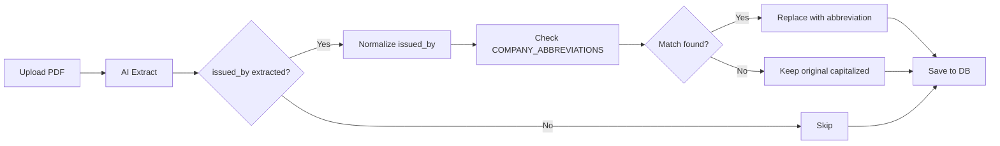

# Issued By Abbreviation System

## 📋 Overview
Hệ thống tự động chuẩn hóa tên công ty trong trường `Issued By` thành dạng viết tắt đồng nhất để đảm bảo consistency trong dữ liệu.

---

## 🎯 Vấn Đề Cần Giải Quyết

### **Before (Không đồng nhất):**
```
Test Report 1: Issued By = "Chau Giang"
Test Report 2: Issued By = "Chau Giang Maritime"  
Test Report 3: Issued By = "Chau Giang Marine"
Test Report 4: Issued By = "CGM"

→ Cùng một công ty nhưng 4 cách viết khác nhau!
```

### **After (Đồng nhất):**
```
Test Report 1: Issued By = "CGM"
Test Report 2: Issued By = "CGM"  
Test Report 3: Issued By = "CGM"
Test Report 4: Issued By = "CGM"

→ Tất cả đều hiển thị "CGM" một cách nhất quán!
```

---

## 🔧 Cách Hoạt Động

### **1. AI Extraction**
```
PDF File → AI phân tích → Trích xuất "Chau Giang Maritime"
```

### **2. Normalization (Tự động)**
```
"Chau Giang Maritime" → Kiểm tra COMPANY_ABBREVIATIONS → "CGM"
```

### **3. Lưu vào Database**
```
MongoDB Test Reports Collection:
  issued_by: "CGM" ✅ (Đã được chuẩn hóa)
```

---

## 📊 Danh Sách Company Abbreviations

### **Vietnamese Companies**
| Full Name | Variations | Abbreviation |
|-----------|------------|--------------|
| Chau Giang Maritime | "Chau Giang", "Chau Giang Marine", "CGM" | **CGM** |
| Viet Tech | "VITECH" | **VITECH** |
| Vietnam Register | "VR" | **VR** |

### **Classification Societies**
| Full Name | Variations | Abbreviation |
|-----------|------------|--------------|
| Lloyd's Register | "Lloyds Register", "LR" | **LR** |
| Bureau Veritas | "BV" | **BV** |
| Det Norske Veritas | "DNV GL", "DNV" | **DNV** |
| American Bureau of Shipping | "ABS" | **ABS** |
| Nippon Kaiji Kyokai | "Class NK", "NK" | **NK** |
| Korean Register | "KR" | **KR** |
| China Classification Society | "CCS" | **CCS** |
| Russian Maritime Register | "RS" | **RS** |
| Indian Register of Shipping | "IRS" | **IRS** |

---

## 🔍 Logic Matching

### **1. Direct Match (Khớp trực tiếp)**
```python
Input: "cgm"
Mapping: "cgm" → "CGM"
Output: "CGM" ✅
```

### **2. Case-Insensitive Match**
```python
Input: "Chau Giang Maritime"
Lowercase: "chau giang maritime"
Mapping: "chau giang maritime" → "CGM"
Output: "CGM" ✅
```

### **3. Cleaned Match (Bỏ ký tự đặc biệt)**
```python
Input: "Lloyd's Register"
Cleaned: "lloyds register"
Mapping: "lloyds register" → "LR"
Output: "LR" ✅
```

### **4. Partial Match (Khớp một phần)**
```python
Input: "Chau Giang Marine Services"
Contains: "chau giang"
Mapping: "chau giang" → "CGM"
Output: "CGM" ✅
```

### **5. No Match (Không tìm thấy)**
```python
Input: "Unknown Company Ltd"
No mapping found
Output: "Unknown Company Ltd" (giữ nguyên, capitalize first letters)
```

---

## 📝 Implementation Details

### **File Structure:**
```
/app/backend/
├── issued_by_abbreviation.py  (NEW - Logic module)
└── server.py                   (Updated - Integration)
```

### **Integration Points:**

#### **1. Single File Processing (server.py):**
```python
# After Valid Date calculation
if analysis_result.get('issued_by'):
    from issued_by_abbreviation import normalize_issued_by
    
    original_issued_by = analysis_result['issued_by']
    normalized_issued_by = normalize_issued_by(original_issued_by)
    analysis_result['issued_by'] = normalized_issued_by
```

#### **2. Split PDF Processing (server.py):**
```python
# After Valid Date calculation (split PDF path)
if analysis_result.get('issued_by'):
    from issued_by_abbreviation import normalize_issued_by
    
    original_issued_by = analysis_result['issued_by']
    normalized_issued_by = normalize_issued_by(original_issued_by)
    analysis_result['issued_by'] = normalized_issued_by
```

---

## 🎓 Usage Examples

### **Example 1: Chau Giang Variations**
```yaml
Test 1:
  AI Extracted: "Chau Giang"
  Normalized: "CGM"
  Saved: "CGM" ✅

Test 2:
  AI Extracted: "Chau Giang Maritime"
  Normalized: "CGM"
  Saved: "CGM" ✅

Test 3:
  AI Extracted: "Chau Giang Marine"
  Normalized: "CGM"
  Saved: "CGM" ✅

Test 4:
  AI Extracted: "cgm"
  Normalized: "CGM"
  Saved: "CGM" ✅
```

### **Example 2: Classification Societies**
```yaml
Lloyd's Register:
  AI Extracted: "Lloyd's Register"
  Normalized: "LR"
  Saved: "LR" ✅

Lloyd's (short form):
  AI Extracted: "Lloyds"
  Normalized: "LR"
  Saved: "LR" ✅

American Bureau of Shipping:
  AI Extracted: "American Bureau of Shipping"
  Normalized: "ABS"
  Saved: "ABS" ✅
```

### **Example 3: Unknown Company**
```yaml
Unknown Company:
  AI Extracted: "maritime services co ltd"
  No Match Found
  Normalized: "Maritime Services Co Ltd" (Capitalized)
  Saved: "Maritime Services Co Ltd" ⚠️
```

---

## ➕ Thêm Company Abbreviation Mới

### **Option 1: Thêm vào Code (Permanent)**
Chỉnh sửa file `/app/backend/issued_by_abbreviation.py`:

```python
COMPANY_ABBREVIATIONS = {
    # ... existing entries ...
    
    # Add new company
    "new company name": "NCN",
    "new company": "NCN",
    "ncn": "NCN",
}
```

### **Option 2: Thêm Runtime (Dynamic)**
```python
from issued_by_abbreviation import add_custom_abbreviation

add_custom_abbreviation("Saigon Marine Services", "SMS")
# Now "Saigon Marine Services" → "SMS"
```

---

## 🔄 Workflow



---

## 📊 Before & After Comparison

### **Database Records:**

#### **Before Normalization:**
```json
[
  { "id": "1", "test_report_name": "AIS", "issued_by": "Chau Giang" },
  { "id": "2", "test_report_name": "EPIRB", "issued_by": "Chau Giang Maritime" },
  { "id": "3", "test_report_name": "SART", "issued_by": "Chau Giang Marine" },
  { "id": "4", "test_report_name": "SSAS", "issued_by": "CGM" }
]
```

#### **After Normalization:**
```json
[
  { "id": "1", "test_report_name": "AIS", "issued_by": "CGM" },
  { "id": "2", "test_report_name": "EPIRB", "issued_by": "CGM" },
  { "id": "3", "test_report_name": "SART", "issued_by": "CGM" },
  { "id": "4", "test_report_name": "SSAS", "issued_by": "CGM" }
]
```

### **UI Display:**

#### **Before:**
```
Row 6: AIS       | Chau Giang          ❌
Row 7: EPIRB     | Chau Giang Maritime ❌
Row 8: SART      | Chau Giang Marine   ❌
Row 9: SSAS      | CGM                 ❌
```

#### **After:**
```
Row 6: AIS       | CGM ✅
Row 7: EPIRB     | CGM ✅
Row 8: SART      | CGM ✅
Row 9: SSAS      | CGM ✅
```

---

## ⚠️ Important Notes

### **1. Existing Records:**
Logic này chỉ áp dụng cho **Test Reports mới** được upload sau khi cập nhật.

**Để chuẩn hóa dữ liệu cũ**, cần chạy migration script:
```python
# Pseudocode
for test_report in db.test_reports.find():
    if test_report['issued_by']:
        normalized = normalize_issued_by(test_report['issued_by'])
        db.test_reports.update_one(
            {'id': test_report['id']},
            {'$set': {'issued_by': normalized}}
        )
```

### **2. Manual Entries:**
Nếu người dùng nhập manual qua "Add Test Report Modal", issued_by sẽ KHÔNG được normalize tự động.

### **3. Case Sensitivity:**
Matching không phân biệt chữ hoa/thường:
- "CGM", "cgm", "Cgm" → Tất cả match với "CGM"

---

## 🚀 Benefits

1. **Consistency**: Cùng một công ty luôn hiển thị cùng một cách
2. **Easy Filtering**: Dễ dàng filter/group by issued_by
3. **Data Quality**: Cải thiện chất lượng dữ liệu
4. **Professional**: Hiển thị chuyên nghiệp hơn
5. **Scalable**: Dễ dàng thêm abbreviations mới

---

*Last Updated: 2025-01-26*
